# Spring AI RAG and Agents Demo

A simple console-based RAG (Retrieval Augmented Generation) and Evaluator-Optimizer Agent implementation using Spring AI, Azure OpenAI, and Azure PostgreSQL with vector search capabilities. This demo is designed for educational purposes to teach RAG and Agents concepts through hands-on examples.

## Features

- Console interface using Spring Shell for interactive learning
- Vector similarity search using Azure PostgreSQL with pgvector extension
- Integration with Azure OpenAI for embeddings and chat completion
- Educational comments explaining RAG concepts
- Sample data for demonstration
- Comprehensive RAG and Writer-Evaluator workflow implementation

## Architecture

The application consists of two main components: the RAG Service and the Writer-Evaluator Agent. The implementation leverages Spring AI's integration capabilities to seamlessly connect with Azure services and manage the workflow orchestration.

### Technology Integration Points

- **Spring AI**: Acts as the orchestration layer, managing the interaction between components, handling embeddings generation, and coordinating the RAG workflow.
- **Azure OpenAI**: Powers all AI operations including embeddings generation, chat completions for both RAG responses and blog content generation/evaluation.
- **Azure PostgreSQL**: Stores and manages vector embeddings using pgvector extension, enabling efficient similarity search for RAG context retrieval.
- **Azure Container Apps**: Provides the serverless hosting environment for deploying and running the application, with built-in scaling and monitoring capabilities.

Below are the detailed flow diagrams showing how these technologies interact:

```mermaid
graph TD
  %% Writer Evaluator Agent
  subgraph BlogWriter_Service [Writer Evaluator Agent - Spring AI Orchestrated]
    A1[Blog Topic Input] --> B1[Spring AI: Initialize Writer Task]
    B1 --> C1[Azure OpenAI: Chat Completion API - Writer Role]
    C1 --> D1[Initial Blog Draft in Azure PostgreSQL]
    D1 --> E1[Spring AI: Initialize Evaluation]
    E1 --> F1[Azure OpenAI: Chat Completion API - Evaluator Role]
    F1 --> G1{Spring AI: Process Evaluation}
    G1 -- "PASS" --> H1[Final Blog Post in Azure PostgreSQL]
    G1 -- "NEEDS_IMPROVEMENT" --> I1[Spring AI: Process Feedback]
    I1 --> J1[Spring AI: Prepare Refinement]
    J1 --> C1
  end

  %% RAG Service Flow
  subgraph RAG_Service [RAG Flow - Spring AI Orchestrated]
    K1[User Query Input] --> L1[Spring AI: Prepare Embedding]
    L1 --> M1[Azure OpenAI: Embedding API]
    M1 --> N1[Query Vector]
    N1 --> O1[Azure PostgreSQL: Vector Search]
    O1 --> P1[Azure PostgreSQL: Retrieve Context]
    P1 --> Q1[Spring AI: Construct Enhanced Prompt]
    Q1 --> R1[Azure OpenAI: Chat Completion API]
    R1 --> S1[Generated Response]
    S1 --> T1[Azure PostgreSQL: Store Q&A Pair]
  end
```



### Flow Description

**RAG Service Flow**:
1. Spring AI manages the initial query processing and coordinates the RAG workflow
2. Azure OpenAI generates embeddings for the query using its Embedding API
3. Azure PostgreSQL performs vector similarity search to find relevant context
4. Spring AI constructs the enhanced prompt with retrieved context
5. Azure OpenAI generates the final response using its Chat API
6. The interaction is stored back in Azure PostgreSQL for future reference

**Writer-Evaluator Flow**:
1. Spring AI orchestrates the content generation and evaluation cycle
2. Azure OpenAI handles both content generation (Writer Role) and evaluation (Evaluator Role)
3. The feedback loop continues until the content meets quality criteria
4. All content versions and feedback are stored in Azure PostgreSQL for tracking

### Key Components

1. **RAG Service**:
   - Utilizes Azure OpenAI for generating embeddings and chat completions
   - Leverages Azure PostgreSQL with pgvector for efficient vector similarity search
   - Implements Spring AI for seamless integration and processing

2. **Writer-Evaluator Agent**:
   - Employs Azure OpenAI with different roles for content generation and evaluation
   - Features an iterative improvement loop based on evaluation feedback
   - Integrated with Spring AI for workflow management

## Prerequisites

- Java 17 or later
- Maven
- PostgreSQL with pgvector extension
- Azure OpenAI service access

## Setup

1. Clone the repository:
   ```bash
   git clone https://github.com/thegovind/spring-ai-rag.git
   cd spring-ai-rag
   ```

2. Copy `.env.example` to `.env` and configure:
   ```bash
   cp .env.example .env
   # Edit .env with your Azure OpenAI and PostgreSQL credentials
   ```

3. Build the application:
   ```bash
   mvn clean install
   ```

4. Run the application:
   ```bash
   mvn spring-boot:run
   ```

## Usage

The application provides a shell interface with the following commands:

- `help` - Show available commands and usage information
- `ask "Your question"` - Ask questions using RAG
- `exit` - Exit the application

Example:
```bash
ask "What is Spring AI?"
```

## How It Works

1. **Vector Embedding**: User questions are converted to vector embeddings using Azure OpenAI.
2. **Similarity Search**: The system finds similar previous Q&As using PostgreSQL vector similarity.
3. **Context Enhancement**: Found Q&As provide context for generating new answers.
4. **Response Generation**: Azure OpenAI generates responses using the enhanced context.

## Educational Resources

- [Spring AI Documentation](https://docs.spring.io/spring-ai/reference/)
- [Azure OpenAI Service](https://learn.microsoft.com/azure/cognitive-services/openai/)
- [PostgreSQL pgvector](https://github.com/pgvector/pgvector)

## Contributing

Pull requests are welcome! Please read our contributing guidelines first.

## License

This project is licensed under the MIT License - see the LICENSE file for details.
